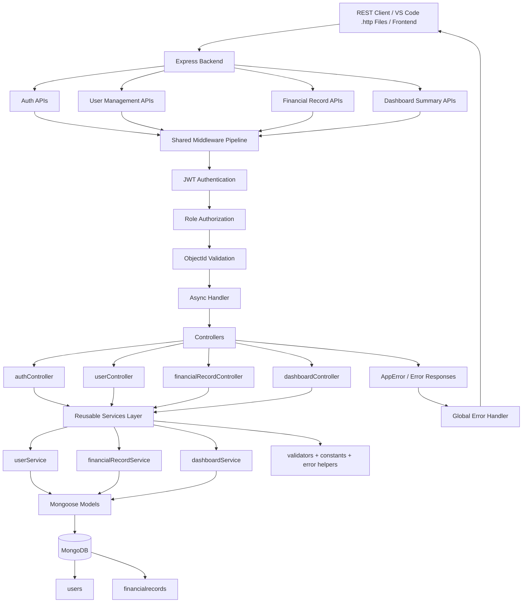

# Finance Backend API

## 1. Overview

This project is a finance backend built with Node.js, Express, and MongoDB for authentication, user management, financial record management, and dashboard analytics. It supports three roles, `viewer`, `analyst`, and `admin`, with role-based access control, centralized validation, and structured error handling.

## 2. Architecture


```text
REST Client / VS Code .http Files / Frontend
        |
        v
Express Backend (Node.js)
        |
        +-- Auth APIs
        +-- User Management APIs
        +-- Financial Record APIs
        +-- Dashboard Summary APIs
        |
        +-- JWT Authentication Middleware
        +-- Role Authorization Middleware
        +-- ObjectId Validation Middleware
        +-- Validation + Error Middleware
        +-- Async Handler Middleware
        |
        +-----------------------------+
        |                             |
        v                             v
   Controllers                    Shared Services
        |                             |
        +-- authController            +-- userService
        +-- userController            +-- financialRecordService
        +-- financialRecordController +-- dashboardService
        +-- dashboardController       +-- validators
        |                             +-- constants
        |                             +-- app error helpers
        |                             |
        +-------------+---------------+
                      |
                      v
               Mongoose Models
                      |
                      v
              MongoDB Database
                      |
                      +-- users
                      +-- financialrecords
```



## Setup

### Install

```bash
npm install
```

### Environment

Create or update `.env`:

```env
MONGO_URI=your_mongodb_connection_string
PORT=4000
JWT_SECRET=your_secret_key_change_in_production
```

### Run

```bash
npm start
```

Base URL:

```text
http://localhost:4000/api
```

## 4. APIs and Descriptions for Each User

### Public APIs

| Method | Endpoint | Access | Description |
|---|---|---|---|
| `POST` | `/api/auth/register` | Public | Register a new user. New users are created with the `viewer` role by default. |
| `POST` | `/api/auth/login` | Public | Log in with email and password and receive a JWT token. |
| `GET` | `/api/health` | Public | Simple health check endpoint. |

### Admin APIs

| Method | Endpoint | Access | Description |
|---|---|---|---|
| `GET` | `/api/auth/profile` | Admin | Get the current admin profile. |
| `GET` | `/api/users` | Admin | Get all users. |
| `GET` | `/api/users/:id` | Admin | Get any user by id. |
| `PATCH` | `/api/users/:id` | Admin | Update a user's `name`, `role`, or `status`. |
| `PATCH` | `/api/users/:id/role` | Admin | Change a user's role. |
| `PATCH` | `/api/users/:id/status` | Admin | Toggle a user's status between `active` and `inactive`. |
| `DELETE` | `/api/users/:id` | Admin | Delete a user, except self-deletion is blocked. |
| `POST` | `/api/financial-records` | Admin | Create a financial record for any user. |
| `GET` | `/api/financial-records` | Admin | Get all financial records or filter them by query params. |
| `GET` | `/api/financial-records/:id` | Admin | Get any financial record by id. |
| `PATCH` | `/api/financial-records/:id` | Admin | Update any financial record. |
| `DELETE` | `/api/financial-records/:id` | Admin | Delete any financial record. |
| `GET` | `/api/dashboard/summary` | Admin | Get dashboard summaries across all records or by filtered scope. |

### Analyst APIs

| Method | Endpoint | Access | Description |
|---|---|---|---|
| `GET` | `/api/auth/profile` | Analyst | Get the current analyst profile. |
| `GET` | `/api/users/:id` | Analyst | Get a user by id only when it is the analyst's own id. |
| `POST` | `/api/financial-records` | Analyst | Create a financial record. Analysts may assign records to a specific user via `userId`. |
| `GET` | `/api/financial-records` | Analyst | Get financial records or filter by type, category, date, and optional `userId`. |
| `GET` | `/api/financial-records/:id` | Analyst | Get a financial record by id. |
| `PATCH` | `/api/financial-records/:id` | Analyst | Update a financial record. |
| `GET` | `/api/dashboard/summary` | Analyst | Get summary data such as totals, category totals, recent activity, and trends. |

### User APIs (`viewer`)

| Method | Endpoint | Access | Description |
|---|---|---|---|
| `GET` | `/api/auth/profile` | Viewer | Get the current user profile. |
| `GET` | `/api/users/:id` | Viewer | Get a user by id only when it matches the current user's own id. |
| `GET` | `/api/financial-records` | Viewer | Get only the current user's own financial records. |
| `GET` | `/api/financial-records/:id` | Viewer | Get one financial record only if it belongs to the current user. |

### Dashboard Summary Response Includes

| Field | Meaning |
|---|---|
| `overview.totalIncome` | Sum of all income records in the filtered scope |
| `overview.totalExpenses` | Sum of all expense records in the filtered scope |
| `overview.netBalance` | `totalIncome - totalExpenses` |
| `overview.totalRecords` | Count of records in scope |
| `categoryTotals` | Totals grouped by category and type |
| `recentActivity` | Most recent 5 records in scope |
| `trends` | Monthly or weekly grouped totals and net balance |

### Financial Record Filter Query Parameters

| Query Param | Example | Description |
|---|---|---|
| `type` | `income` or `expense` | Filter by record type |
| `category` | `Software` | Filter by category |
| `dateFrom` | `2026-01-01` | Start date filter |
| `dateTo` | `2026-12-31` | End date filter |
| `userId` | Mongo ObjectId | Admin or analyst can scope records to a specific user |

## Access Control Summary

| Action | Viewer | Analyst | Admin |
|---|---|---|---|
| Register and login | Yes | Yes | Yes |
| View own profile | Yes | Yes | Yes |
| Get all users | No | No | Yes |
| Get own user by id | Yes | Yes | Yes |
| Get any user by id | No | No | Yes |
| Update users | No | No | Yes |
| Change user role | No | No | Yes |
| Toggle user status | No | No | Yes |
| Delete users | No | No | Yes |
| Create financial records | No | Yes | Yes |
| View financial records | Own only | Yes | Yes |
| Update financial records | No | Yes | Yes |
| Delete financial records | No | No | Yes |
| Access dashboard summary | No | Yes | Yes |


## 5. Use of Each `.http` File

### `req.http`

Purpose:
Provides demo setup requests for creating demo users, demo analysts, and demo admins.

Use it when:

- you want to bootstrap test users
- you need login requests for each demo account
- you want a quick starting point before switching to role-specific files

Important note:
`/auth/register` creates users as `viewer` by default, so promoting a user to `analyst` or `admin` requires an existing admin token.

### `req.admin.http`

Purpose:
Manual testing file for admin-only and full-access workflows.

Use it when:

- testing user management APIs
- creating, updating, or deleting financial records
- validating dashboard summary endpoints
- testing full-access scenarios

Variables to set:

- `@adminToken`
- `@userId`
- `@recordId`

### `req.analyst.http`

Purpose:
Manual testing file for analyst workflows.

Use it when:

- creating financial records
- filtering records
- updating records
- testing dashboard summaries and weekly trends

Variables to set:

- `@analystToken`
- `@userId`
- `@recordId`

### `req.user.http`

Purpose:
Manual testing file for regular user (`viewer`) behavior.

Use it when:

- verifying own-profile access
- verifying read-only access to own records
- verifying blocked operations return `403`

Variables to set:

- `@userToken`
- `@userId`
- `@recordId`

## Example Manual Testing Flow

1. Use [req.http](/C:/Users/lukka/OneDrive/Desktop/zor/req.http) to create demo accounts.
2. Promote demo analyst and demo admin using an existing admin token.
3. Log in and copy the returned JWT tokens.
4. Open [req.admin.http](/C:/Users/lukka/OneDrive/Desktop/zor/req.admin.http), [req.analyst.http](/C:/Users/lukka/OneDrive/Desktop/zor/req.analyst.http), or [req.user.http](/C:/Users/lukka/OneDrive/Desktop/zor/req.user.http).
5. Replace the placeholders with real ids and tokens.
6. Run the requests using the VS Code REST Client extension.


## Notes

- This mini project is made for Zorvyn Finance Data Processing and Access Control Backend assignment for Backend Intern Role.
